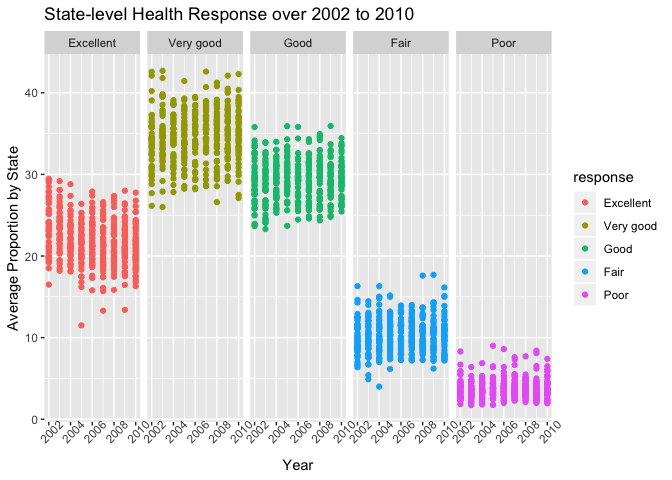
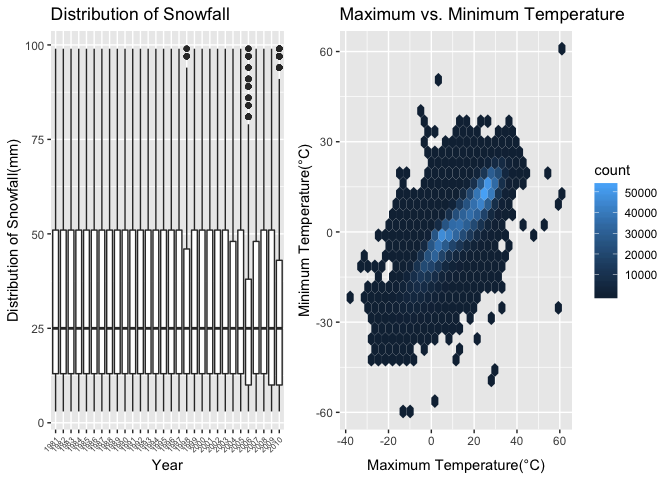

p8105\_hw2\_hy2580
================
haokun yuan
10/10/2018

Problem 1
---------

Import and clean data

``` r
brfss_overallhealth = brfss_smart2010 %>%
  janitor::clean_names() %>% 
  # focused on Overall Health topic
  # checked response with distinct(), no pre-collapsed categories
  filter(topic == "Overall Health") %>% 
  # take levels form excellent to poor by factorize response
  mutate(response = fct_relevel(response,c("Excellent","Very good","Good","Fair","Poor")))
```

Find states were observed at 7 locations in 2002

``` r
brfss_overallhealth %>% 
  filter(year == 2002) %>%
  distinct(locationabbr,locationdesc) %>% 
  count(locationabbr) %>% 
  filter(n == 7)
```

    ## # A tibble: 3 x 2
    ##   locationabbr     n
    ##   <chr>        <int>
    ## 1 CT               7
    ## 2 FL               7
    ## 3 NC               7

CT, FL, NC were observed at 7 locations in 2002.

Make a spaghetti plot for number of observations in each state from 2002 to 2010

``` r
n_observations =
  brfss_overallhealth %>% 
  group_by(year,locationabbr) %>% 
  count(locationabbr)

n_observations %>%   
  ggplot(aes( x = year, y = n, color = locationabbr)) +
  geom_line() + 
  labs(x = "Year", y = "Number of Observations", title = "Number of Observations in States (U.S.)", subtitle = "(2002-2010)")
```


``` r
n_observations %>% 
  arrange(desc(n))
```

    ## # A tibble: 443 x 3
    ## # Groups:   year, locationabbr [443]
    ##     year locationabbr     n
    ##    <int> <chr>        <int>
    ##  1  2007 FL             220
    ##  2  2010 FL             205
    ##  3  2005 NJ              95
    ##  4  2006 NJ              95
    ##  5  2009 NJ              95
    ##  6  2010 NJ              95
    ##  7  2008 NJ              90
    ##  8  2007 NJ              80
    ##  9  2008 NC              80
    ## 10  2010 TX              80
    ## # ... with 433 more rows

As shown above, FL is most observed in 2007 and 2010, is it likely some event occured in those two years that make the data more accessible. One the other hand, NJ appears to be more observed during the entire observation period (2002-2010), which may be a result of more healthcare facilities within the state.

Make a table showing, for the years 2002, 2006, and 2010, the mean and standard deviation of the proportion of “Excellent” responses across locations in NY State.

``` r
brfss_overallhealth %>% 
  filter(year %in% c(2002, 2006, 2010),
         response == "Excellent",
         locationabbr == "NY") %>%
  group_by(year) %>%
  summarise(mean(data_value),
            sd(data_value)) %>% 
  knitr::kable(digits = 2,
               col.names = c("Year", "Mean", "Standard Deviation"))
```

|  Year|   Mean|  Standard Deviation|
|-----:|------:|-------------------:|
|  2002|  24.04|                4.49|
|  2006|  22.53|                4.00|
|  2010|  22.70|                3.57|

As the table shown above, Year 2002 appears to have the largest mean and standard deviation of the proportion of "Excellent" response across locations in NY state. While Year 2006 have the smallest mean and Year 2010 has the smallest standard deviation.

For each year and state, compute the average proportion in each response category (taking the average across locations in a state). Make a five-panel plot that shows, for each response category separately, the distribution of these state-level averages over time.

``` r
brfss_overallhealth %>%
  group_by(locationabbr, year, response) %>% 
  summarize(avg_prop = mean(data_value)) %>% 
  ggplot(aes(x = year, avg_prop, color = response)) + 
  geom_point() +
  facet_grid(~ response) +
  labs(title = "State-level Health Response over 2002 to 2010",
         x = "Year",
         y = "Average Proportion by State") +
  theme(axis.text.x = element_text(angle = 45))
```

    ## Warning: Removed 21 rows containing missing values (geom_point).

 The distribution of each response across years appears to be concentrate. And the proportion of responses different by the level of response. The most likely response is "Very Good", while the least likely response is "Poor".

Problem2
--------

This problem uses the Instacart data. DO NOT include this dataset in your local data directory; instead, load the data from the p8105.datasets package (it’s called instacart).

The goal is to do some exploration of this dataset. To that end, write a short description of the dataset, noting the size and structure of the data, describing some key variables, and giving illstrative examples of observations. Then, do or answer the following (commenting on the results of each):

``` r
instacart_tidy = instacart %>%
  janitor::clean_names() %>% 
  na.omit()
```

How many aisles are there, and which aisles are the most items ordered from?

``` r
instacart_tidy %>% 
  distinct(aisle) %>% 
  nrow()
```

    ## [1] 134

``` r
instacart_tidy %>% 
  count(aisle) %>% 
  arrange(desc(n))
```

    ## # A tibble: 134 x 2
    ##    aisle                              n
    ##    <chr>                          <int>
    ##  1 fresh vegetables              150609
    ##  2 fresh fruits                  150473
    ##  3 packaged vegetables fruits     78493
    ##  4 yogurt                         55240
    ##  5 packaged cheese                41699
    ##  6 water seltzer sparkling water  36617
    ##  7 milk                           32644
    ##  8 chips pretzels                 31269
    ##  9 soy lactosefree                26240
    ## 10 bread                          23635
    ## # ... with 124 more rows

There are 134 aisles, and the aisles that has most items ordered from is listed in the table above. From the table, we know that fresh vegetables are the most ordered, and fresh fruits is the second, which indicate customers are more willing to order fresh producs from instacart.

Make a plot that shows the number of items ordered in each aisle. Order aisles sensibly, and organize your plot so others can read it.

``` r
instacart_tidy %>% 
  count(aisle) %>%
  ggplot(aes(x = reorder(aisle, -n, sum), n)) +
  geom_point() +
  theme(axis.text.x = element_text(size = 6, angle = 45, hjust = 1)) +
  labs(x = "Aisle Name",
       y = "Number of Items Ordered",
       title = "Number of Items Ordered in each Aisle" )
```

 The plot above showed the number of items ordered in each aisle from a descending order.

Make a table showing the most popular item in each of the aisles “baking ingredients”, “dog food care”, and “packaged vegetables fruits”.

``` r
instacart_tidy %>% 
  filter(aisle %in% c("baking ingredients","dog food care","packaged vegetables fruits")) %>% 
  group_by(aisle) %>% 
  count(product_name) %>% 
  top_n(1,n) %>% 
  knitr::kable(col.names = c("Aisle", "Most Order Item", "Ordered Number"))
```

| Aisle                      | Most Order Item                               |  Ordered Number|
|:---------------------------|:----------------------------------------------|---------------:|
| baking ingredients         | Light Brown Sugar                             |             499|
| dog food care              | Snack Sticks Chicken & Rice Recipe Dog Treats |              30|
| packaged vegetables fruits | Organic Baby Spinach                          |            9784|

Lighter brown sugar was the most ordered item among baking ingredients, which had 499 orders, Snack Sticks Chicken & Rice Recipe Dog Treats is the most ordered dog food care with 30 orders, Orgainic Baby Spinach had 9784 orders and listed as the most ordered item in packaged vegetables fruits. ALthough those three product are most ordered item at their aisle, the ordered number is significantly different.

Make a table showing the mean hour of the day at which Pink Lady Apples and Coffee Ice Cream are ordered on each day of the week; format this table for human readers (i.e. produce a 2 x 7 table).

``` r
instacart_tidy %>%
  filter(product_name %in% c("Pink Lady Apples","Coffee Ice Cream")) %>% 
  mutate(order_dow = 
           factor(order_dow, levels = 0:6, labels = c("Sunday", "Monday", "Tuesday", "Wednesday", "Thursday", "Friday", "Saturday"))) %>% 
  group_by(product_name, order_dow) %>% 
  summarize(mean = mean(order_hour_of_day)) %>% 
  spread(order_dow, mean) %>% 
  knitr::kable(digits = 2,
               col.names = c("Product Name", "Sunday", "Monday", "Tuesday", "Wednesday", "Thursday", "Friday", "Saturday"))
```

| Product Name     |  Sunday|  Monday|  Tuesday|  Wednesday|  Thursday|  Friday|  Saturday|
|:-----------------|-------:|-------:|--------:|----------:|---------:|-------:|---------:|
| Coffee Ice Cream |   13.77|   14.32|    15.38|      15.32|     15.22|   12.26|     13.83|
| Pink Lady Apples |   13.44|   11.36|    11.70|      14.25|     11.55|   12.78|     11.94|

The table above showed the mean hour of the day at which the Pink Lady Apples and Coffee Ice Creams are ordered. we can see that most orders were ordered betweem 11 to 15.4. And this number may indicate a time that those products need refill.

Problem 3
---------

This problem uses the NY NOAA data. DO NOT include this dataset in your local data directory; instead, load the data from the p8105.datasets package (it’s called ny\_noaa).

The goal is to do some exploration of this dataset. To that end, write a short description of the dataset, noting the size and structure of the data, describing some key variables, and indicating the extent to which missing data is an issue. Then, do or answer the following (commenting on the results of each):

``` r
ny_noaa_tidy = ny_noaa %>%
  janitor::clean_names() %>% 
  separate("date", c("year", "month", "day"), sep = "-") %>% 
  mutate(tmax = as.numeric(tmax)/10,
         tmin = as.numeric(tmin)/10,
         day = as.numeric(day),
         month = factor(month.abb[as.numeric(month)], level = month.abb),
         prcp = prcp/10)
```

Do some data cleaning. Create separate variables for year, month, and day. Ensure observations for temperature, precipitation, and snowfall are given in reasonable units. For snowfall, what are the most commonly observed values? Why?

``` r
ny_noaa_tidy %>% 
  count(snow) %>%
  top_n(1,n)
```

    ## # A tibble: 1 x 2
    ##    snow       n
    ##   <int>   <int>
    ## 1     0 2008508

The most observed value of snowfall is zero, unlike rainfall, snow falls only under relatively cold weather.

Make a two-panel plot showing the average max temperature in January and in July in each station across years. Is there any observable / interpretable structure? Any outliers?

``` r
ny_noaa_tidy %>% 
  filter(month %in% c("Jan", "Jul")) %>% 
  group_by(id, month,year) %>%
  summarize(mean = mean(tmax,na.rm = TRUE)) %>% 
  ggplot(aes(year,mean, group = year)) +
  geom_boxplot() +
  facet_grid(~ month) +
  labs(x = "Average Max Temperature", y = "Year", title = "Average Maximum Temperature in January and July in NY from 1980 to 2010")
```

    ## Warning: Removed 5970 rows containing non-finite values (stat_boxplot).


The maximum temperature in July is significantly higher than that of January. And there are few outliers in both month.

Make a two-panel plot showing (i) tmax vs tmin for the full dataset (note that a scatterplot may not be the best option);

``` r
plot_temp = ny_noaa_tidy %>% 
  filter(is.na(tmax) == FALSE, is.na(tmin) == FALSE) %>% 
  ggplot(aes(x = tmax, y = tmin)) + 
  geom_hex() +
  labs(x = "Maximum Temperature(°C)",
       y = "Minimum Temperature(°C)",
       title = "Maximum vs. Minimum Temperature")
```

1.  make a plot showing the distribution of snowfall values greater than 0 and less than 100 separately by year.

``` r
plot_snow = ny_noaa_tidy %>%
  filter(snow > 0, snow < 100) %>%
  ggplot(aes(x = year, y = snow, group = year)) +
  geom_boxplot() +
  labs(x = "Year", 
       y = "Distribution of Snowfall(mm)",
       title = "Distribution of Snowfall") +
   theme(axis.text.x = element_text(angle = 45))
```

``` r
plot_snow + plot_temp
```



Above plot showed the distribution of snowfall and the Maximum vs. Minimum temperature for the full dataset. The distribution of snowfall doesn't varies much by year. and the outliers in two plots matches each other which indicate that there are some extremely cold year that cause more snowfall.

The ny noaa data has 9rows and 2595176columns, they key variables are snowfall, precipitation, maximum temperature and minimum temperature. The data is structure so that we have the observations of variables at each observation points. The missing datas will have more effect on variables like snowfall which has little observations greater than zero.
